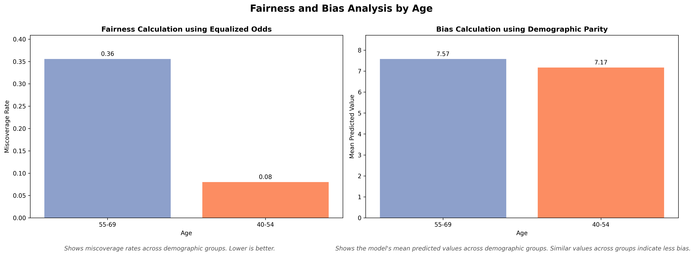
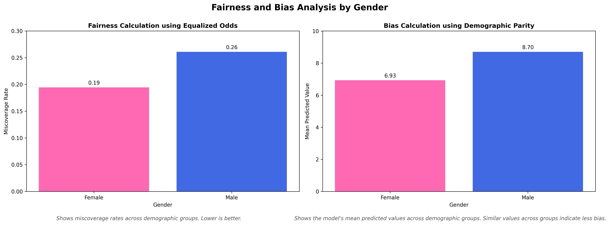
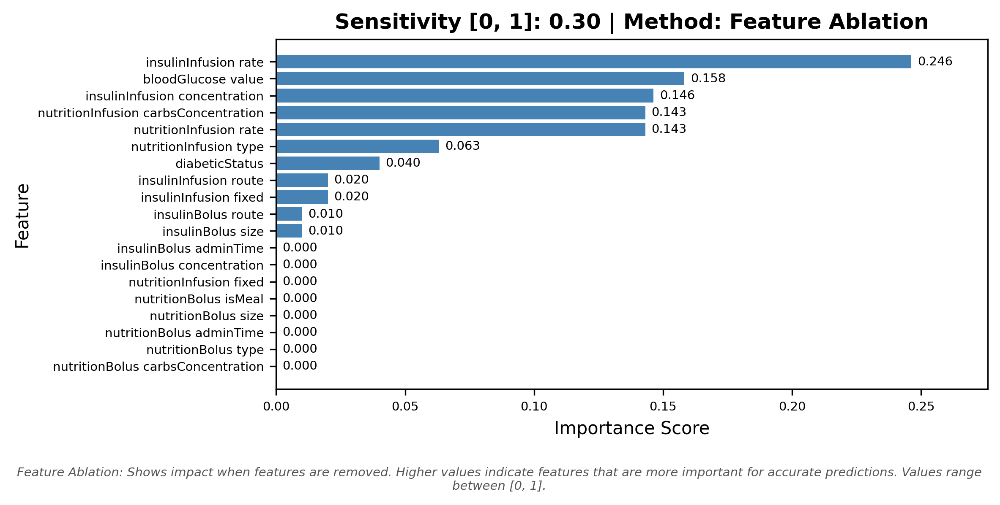
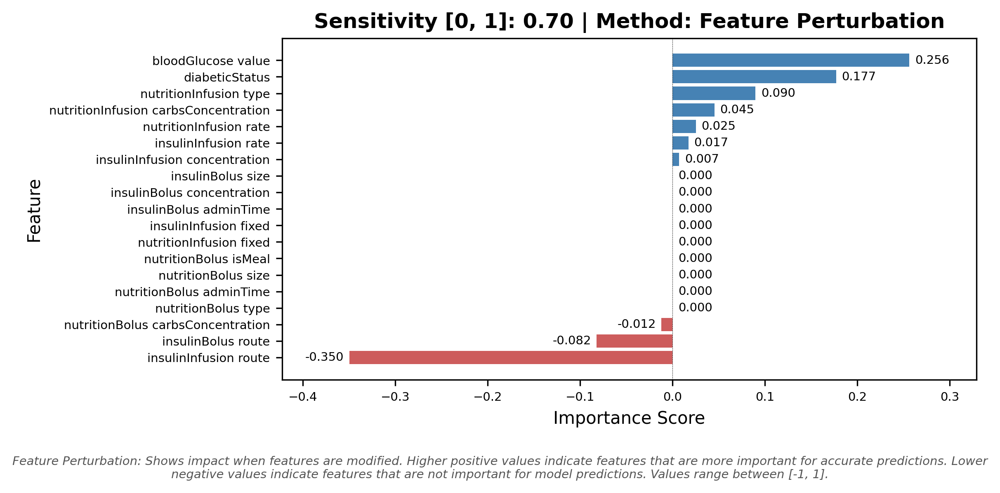
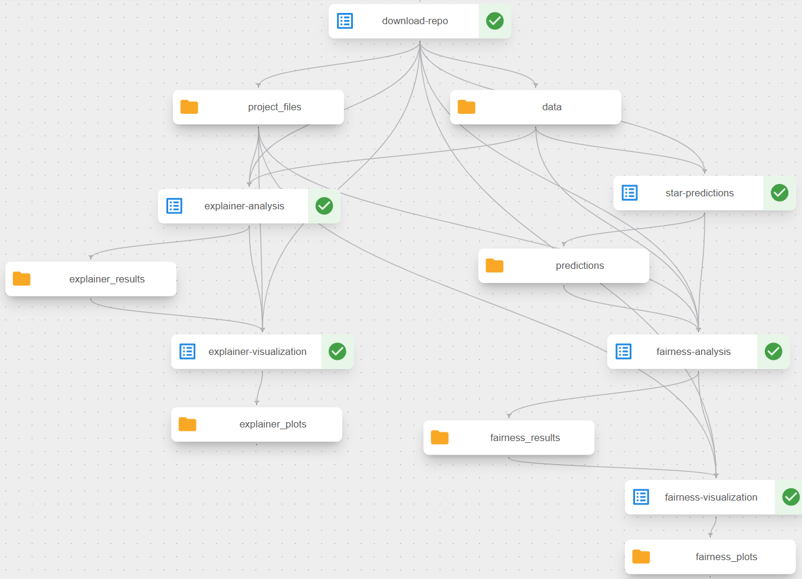
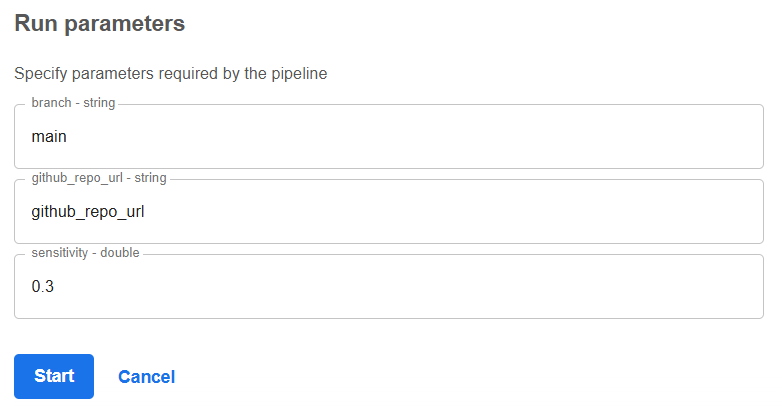

# realm_task_3_3_implementation_xai

## General Task Description

Components developed in Task 3.3 aim to implement agnostic XAI techniques on top of AI models that are used for various tasks such as classification or segmentation. We aim to implement two XAI techniques per Use Case - that would be selected dynamically from the Fuzzy system based on User's Input (sensitivity value coming from the RIANA dashboard), implement bias and fairness metrics (as agreed [here](https://maastrichtuniversity.sharepoint.com/:w:/r/sites/FSE-REALM/_layouts/15/Doc.aspx?sourcedoc=%7B9EDAE561-2787-42D1-BBB8-C9320C0B1F25%7D&file=Report%20on%20Bias%20and%20Fairness%20Metrics%20%5BTask%203.3%5D.docx&action=default&mobileredirect=true)) based on model outputs and extract outputs in a digestible manner (images, metrics, etc.).

This component, no matter the Use Case, expects as input:
- Sensitivity value (RIANA dashboard)
- Trained model (AI Orchestrator)
- Compatible dataset (AI Orchestrator)

This component, no matter the Use Case, returns as output:
- XAI methodology output (depending on the Use Case - image or json file)
- Fairness and Bias results (depending on the Use Case - json file or nothing if we are talking for images)


## STAR Blood Glucose Prediction with Explainability (Use Case 3)

This project provides tools for analyzing and interpreting the predictions made by the STAR model, which predicts blood glucose evolution ranges for ICU patients based on clinical data including insulin administration, nutrition, and historical blood glucose measurements.
It uses Feature Ablation and Feature Perturbation explainability methods to identify key features influencing the model's predictions.
Additionally, it includes fairness/bias analysis to detect potential biases across demographic groups (Age and Gender).

## Project Overview

The STAR model takes patient clinical data (blood glucose history, insulin infusion/bolus, nutrition infusion/bolus, diabetic status) and predicts a blood glucose range (5th-95th percentile interval) up to 3 hours into the future. This project adds an explainability layer, allowing users to understand why the model makes certain predictions and assess potential biases.

**IMPORTANT**: The model is a physiological-based blood glucose prediction system packaged as a Docker image. The explainability analysis uses model-agnostic techniques (Feature Perturbation for higher sensitivity (≥ 0.5), Feature Ablation for lower sensitivity (< 0.5)) to provide interpretable insights.

Key Components:
1. Input Data: JSON files containing patient clinical data with blood glucose measurements, insulin administration, and nutrition information. More details in the [Data Structure section](#data-structure) below.
2. Model: STAR Docker image (`glucomeo`) for blood glucose range prediction (BG5TH - BG95TH interval).
3. Fairness/Bias Analysis: Performed using the [fairness_bias_analysis.py](./src/fairness_bias_analysis.py) script. Evaluates equalized odds (miscoverage rates) and demographic parity (mean predicted values) across Age and Gender groups. This script can be executed independently and as part of the Kubeflow pipeline component.
4. Explainability Analysis: Performed using the [explainer.py](./src/explainer.py) script with dynamic method selection based on sensitivity value. Again, this script can be executed independently and as part of the Kubeflow pipeline component.
5. Visualizations: Generated using [fairness_bias_visualization.py](./src/fairness_bias_visualization.py) and [explainer_visualization.py](./src/explainer_visualization.py) scripts.


## Getting Started

### Prerequisites
- Python 3.14
- Docker Desktop (to run the STAR model locally)
- Required Python packages (installed via `pip install -r requirements.txt`, can be found in [requirements.txt](./requirements.txt))

### Data Structure

The input data is expected to be in JSON format representing a Patient object. Each patient file contains episodes with the following key components:

| Field | Type | Description |
|-------|------|-------------|
| hospitalID | string | Patient identification ID |
| updateTime | long | Epoch time (ms) when simulation starts |
| episodes | array | Array of control episodes |

**Episode Structure:**

| Field | Type | Description |
|-------|------|-------------|
| diabeticStatus | int | 0=None, 1=Type 1, 2=Type 2 |
| gender | boolean | false=Male, true=Female |
| age | int | Patient age |
| weight | double | Weight in kg (-1 if unknown) |
| bloodGlucose | array | Array of [timestamp, value] pairs (mmol/L) |
| insulinInfusion | array | Array of [timestamp, Infusion$Insulin] |
| insulinBolus | array | Array of [timestamp, Bolus$Insulin] |
| nutritionInfusion | array | Array of [timestamp, Infusion$Nutrition] |
| nutritionBolus | array | Array of [timestamp, Bolus$Nutrition] |

**Infusion$Insulin Structure:**

| Field | Type| Description |
|-------|------|-------------|
| date | long | Timestamp |
| route | int | Route of administration (0=IV, 1=SubQ) |
| rate | double | Rate in ml/h |
| fixed | boolean | Infusion rate fixed |
| concentration | double | Concentration in U/ml |

**Bolus$Insulin Structure:**

| Field | Type | Description |
|-------|------|-------------|
| date | long | Timestamp |
| route | int | Route of administration (0=IV, 1=SubQ) |
| size | double | Bolus size in ml |
| adminTime | double | Administration time in min |
| concentration | double | Concentration in U/ml |

**Infusion$Nutrition Structure:**

| Field | Type | Description |
|-------|------|-------------|
| date | long | Timestamp |
| name | string | Nutrition name |
| type | int | Nutrition type (0=enteral, 1=parenteral, 2=maintenance) |
| fatConcentration | double | Fat concentration in g/L |
| carbsConcentration | double | Carbohydrates concentration in g/L |
| calories | double | Calories concentration in kcal/ml |
| proteinConcentration | double | Proteins concentration in g/L |
| rate | double | Rate in ml/h |
| fixed | boolean | Infusion fixed |

**Bolus$Nutrition Structure:**

| Field | Type | Description |
|-------|------|-------------|
| date | long | Timestamp |
| isMeal | boolean | Whether bolus is a meal |
| size | double | Bolus size in ml |
| adminTime | double | Administration time in min |
| name | string | Nutrition name |
| type | int | Nutrition type (0=enteral, 1=parenteral, 2=maintenance) |
| fatConcentration | double | Fat concentration in g/L |
| carbsConcentration | double | Carbohydrates concentration in g/L |
| calories | double | Calories concentration in kcal/ml |
| proteinConcentration | double | Proteins concentration in g/L |

**Example Patient JSON (simplified):**
```json
{
    "__class": "star.algo.data.Patient",
    "hospitalID": "356_8467_9357",
    "updateTime": 1.584576E+12,
    "episodes": [{
        "__class": "star.algo.data.Episode",
        "age": 54,
        "gender": false,
        "diabeticStatus": 1,
        "bloodGlucose": [
            [1.5845544E+12, 11.111111111111111],
            [1.58455782E+12, 7.7777777777777777],
            [1.5845652E+12, 8.2222222222222214]
        ],
        "insulinInfusion": [
            [1.58455092E+12, {
                "__class": "star.algo.data.Infusion$Insulin",
                "date": 1.58455092E+12,
                "route": 0,
                "rate": 3.50029374,
                "created": 0,
                "fixed": false,
                "concentration": 1
            }]
        ],
        "nutritionInfusion": [
            [1.5845418E+12, {
                "__class": "star.algo.data.Infusion$Nutrition",
                "date": 1.5845418E+12,
                "fatConcentration": 49,
                "rate": 0,
                "created": 0,
                "name": "",
                "fixed": true,
                "carbsConcentration": 141,
                "calories": 1.28,
                "type": 0,
                "proteinConcentration": 63
            }]
        ],
        "insulinBolus": [
          [
              1.5787248E+12,
              {
                  "__class": "star.algo.data.Bolus$Insulin",
                  "date": 1.5787248E+12,
                  "route": 0,
                  "size": 2,
                  "adminTime": 1,
                  "created": 0,
                  "concentration": 1
              }
          ]
        ],
        "nutritionBolus": [
          [
            1.578822E+12,
            {
                "__class": "star.algo.data.Bolus$Nutrition",
                "name": "Dextrose 50",
                "date": 1.578822E+12,
                "type": 1,
                "size": 25,
                "adminTime": 5,
                "created": 0,
                "isMeal": false,
                "fatConcentration": 0,
                "carbsConcentration": 500,
                "calories": 2,
                "proteinConcentration": 0
            }
          ]
        ]
    }]
}
```

### Running the STAR Model

The STAR model is packaged as a Docker image (`glucomeo`). The model processes all JSON files in an input directory and generates a single `results.csv` file in the output directory.

**Docker Run Command:**
```bash
docker run --rm \
  -e AEONICS_JAVA_OPTIONS=-Xmx1g \
  -e AEONICS_LICENSE_STORE_PATH=/opt/aeonics/aeonics.license \
  -e AEONICS_LICENSE_STORE_PASS=secret \
  -e AEONICS_ACCEPT_UNSIGNED_MODULES=true \
  -e AEONICS_LOG_LEVEL=1000 \
  -e REALM_INPUT_DIR=/home/in \
  -e REALM_OUTPUT_DIR=/home/out \
  -w /opt/aeonics \
  -u 0 \
  -v /path/to/input/directory:/home/in \
  -v /path/to/output/directory:/home/out \
  glucomeo
```
Replace `/path/to/input/directory` with the directory containing your patient JSON files and `/path/to/output/directory` with where you want `results.csv` to be saved.

**Output:**
The model generates a `results.csv` file with the following structure:
```csv
BG5TH,BG95TH
7.196445581533928,17.42121412769019
...
```

Where:
- BG5TH: Lower bound (5th percentile) of predicted blood glucose range
- BG95TH: Upper bound (95th percentile) of predicted blood glucose range

### Analyses Execution

In order for the analyses to be executed:
- The patient JSON files should be stored in a data directory.
- The STAR model predictions should be generated first using the Docker command above.
- For input JSON patient data and corresponding predictions CSV, the explainability and fairness analyses can be executed as described in the next sections.

#### Fairness/Bias Analysis

The fairness and bias analysis can be executed independently using the following command:
```bash
python src/fairness_bias_analysis.py --data_path 'path/to/patient_json_files/' --predictions_path 'path/to/results.csv' --output 'output/fairness_analysis.json'
```

Arguments:
- `--data_path`: Path to the directory containing patient JSON files.
- `--predictions_path`: Path to the predictions CSV file generated by the STAR model.
- `--output`: Path to save the output JSON file containing the fairness and bias metrics.

Visualization of the results can be done using the following command:

```bash
python src/fairness_bias_visualization.py --analysis_results 'path/to/fairness_analysis.json' --output output
```

Arguments:
- `--analysis_results`: Path to the JSON file containing the fairness and bias metrics.
- `--output`: Directory to save the generated visualizations. Default is `output`.

#### Explainability Analysis
The explainability analysis can be executed independently using the following command:

```bash
python src/explainer.py --data_path 'path/to/patient_json_files/' --sensitivity 0.3 --output output --docker_image glucomeo --in_docker False
```

Arguments:
- `--data_path`: Path to the directory containing patient JSON files.
- `--sensitivity`: Sensitivity value (between 0 and 1) to determine the explainability technique to be used. Default is `0.3`.
  - sensitivity < 0.5: Feature Ablation analysis
  - sensitivity ≥ 0.5: Feature Perturbation analysis
- `--output`: Directory to save the output files (explanations). Default is `output`.
- `--docker_image`: Name of the Docker image containing the STAR model. Default is `glucomeo`.
- `--in_docker`: Boolean flag indicating whether the script is being run inside the Docker container. Default is `False`.

Visualization of the results can be done using the following command:
```bash
python src/explainer_visualization.py --analysis_results path/to/method_analysis.json --output output --sensitivity 0.3
```

Arguments:
- `--analysis_results`: Path to the analysis results file (JSON).
- `--output`: Directory to save the generated visualizations. Default is `output`.
- `--sensitivity`: Sensitivity value (between 0 and 1) indicating the explainability technique used. Default is `0.3`.
  - sensitivity < 0.5: Feature Ablation analysis
  - sensitivity ≥ 0.5: Feature Perturbation analysis

Alternatively, the analyses and visualizations can be executed as part of the Kubeflow pipeline component, as described in the [Kubeflow Pipeline Component](#kubeflow-pipeline-component) section below.

## JSON Output

### Fairness and Bias Analysis Output
The fairness and bias analysis outputs a JSON file, `fairness_analysis.json`, with the following structure. The metrics are calculated based on two demographic attributes, `age` and `gender`.

```json
{
  "equalized_odds_metrics": {
    "age": {
      "miscoverage_rates_by_group": {
        "55-69": 0.35555555555555557,
        "40-54": 0.08
      }
    },
    "gender": {
      "miscoverage_rates_by_group": {
        "Female": 0.19444444444444445,
        "Male": 0.2608695652173913
      }
    }
  },
  "demographic_parity_metrics": {
    "age": {
      "mean_predicted_values_by_group": {
        "55-69": 7.574489805635386,
        "40-54": 7.170263174095537
      }
    },
    "gender": {
      "mean_predicted_values_by_group": {
        "Female": 6.9331782904765165,
        "Male": 8.703320132350429
      }
    }
  }
}
```

### Explainability Analysis Output
The explainability analysis outputs can either refer to Feature Ablation analysis or Feature Perturbation analysis, depending on the sensitivity value provided as input.

#### Feature Ablation Analysis Output (sensitivity < 0.5)
Feature Ablation analysis produces a JSON file showing the importance of each feature when removed:

`feature_ablation_analysis.json` structure:
```json
{
  "insulinInfusion.rate": 0.2462788801779774,
  "insulinInfusion.concentration": 0.24627888017797728,
  "bloodGlucose.value": 0.15828238653630658,
  "nutritionInfusion.carbsConcentration": 0.14307466769206054,
  "nutritionInfusion.rate": 0.07307466769206054,
  "diabeticStatus": 0.07,
  "nutritionInfusion.type": 0.06301051772361772,
  ...
}
```

#### Feature Perturbation Analysis Output (sensitivity ≥ 0.5)
Feature Perturbation analysis produces a JSON file showing the importance of each feature when modified:

`feature_perturbation_analysis.json` structure:
```json
{
  "bloodGlucose.value": 0.7306851942121095,
  "nutritionInfusion.type": 0.08162662761292885,
  "nutritionInfusion.carbsConcentration": 0.06330500187701027,
  "nutritionInfusion.rate": 0.06330500187701027,
  "insulinInfusion.rate": 0.030058830133406985,
  "insulinInfusion.concentration": 0.030058830133406985,
  ...
}
```

## Visualizations Output

### Fairness and Bias Analysis Visualizations

Equalized Odds and Demographic Parity Plots for Age Demographic column:



Equalized Odds and Demographic Parity Plots for Gender Demographic column:



### Explainability Analysis Visualizations

Feature Ablation Importance Plot (sensitivity < 0.5)  
Feature Perturbation Importance Plot (sensitivity ≥ 0.5)

<p align="center">
  
  
</p>

## Understanding the Results

### Fairness and Bias Analysis Output
The fairness analysis produces:
- Equalized Odds Metrics: Measures miscoverage rates (proportion of times actual blood glucose falls outside predicted interval) across demographic groups. Lower values indicate better predictions.
- Demographic Parity Metrics: Compares mean predicted blood glucose values across demographic groups. Similar values across groups indicate less bias.
- Visualizations: Bar Charts visualizing the above results.

### Explainability Analysis Output
For Feature Ablation (sensitivity < 0.5):
- Shows the impact when features are removed from the model input.
- Higher positive importance scores indicate features that are more critical for accurate predictions.
- Negative importance scores indicate features that are harmful for the model predictions.
- Features with 0.0 importance had no measurable impact when removed.
- Values are normalized to range [-1, 1].

For Feature Perturbation (sensitivity ≥ 0.5):
- Shows the impact when feature values are modified.
- Higher positive importance scores indicate features where changes significantly affect predictions. These features are more critical for accurate predictions.
- Negative importance scores indicate features that are harmful for the model predictions.
- Values are normalized to range [-1, 1].
- The horizontal bar plot ranks features by their sensitivity to perturbation.

**Key Features Analyzed:**
- `bloodGlucose.value`: Historical blood glucose measurements
- `insulinInfusion`: Insulin infusion parameters
- `nutritionInfusion`: Nutrition infusion parameters
- `diabeticStatus`: Patient's diabetes type (None, Type 1, Type 2)
- `insulinBolus`: Insulin bolus parameters
- `nutritionBolus`: Nutrition bolus parameters


## Kubeflow Pipeline Component

The [star_pipeline_component.py](./kubeflow_component/star_pipeline_component.py) file defines a Kubeflow pipeline for automating the STAR XAI analysis workflow. This pipeline orchestrates the following components:

- **Download Component**: Downloads project files and data from a specified GitHub repository and branch. The pipeline expects the repo to contain:
  - Project files in `src/` folder: `STAR_model.py`, `explainer.py`, `fairness_bias_analysis.py`, `fairness_bias_visualization.py`, `explainer_visualization.py`, and utility files in `utils/` subdirectory.
  - Data in `data/` folder: Patient JSON files.
- **STAR Predictions Component**: Runs the STAR Docker model to generate predictions for all patient JSON files. This component:
  - Takes patient JSON files as input
  - Executes the STAR model inside the Docker container
  - Outputs a `results.csv` file with BG5TH and BG95TH predictions
- **Fairness/Bias Analysis**: Executes the fairness and bias analysis using the provided script, generating the output mentioned in the [Fairness and Bias Analysis Output](#fairness-and-bias-analysis-output) section. This component requires both the patient JSON files and the predictions CSV
- **Fairness/Bias Visualization**: Creates visual representations of fairness/bias metrics across demographic groups (Age, Gender), generating consolidated bar charts showing equalized odds (miscoverage rates) and demographic parity (mean predicted values). Outputs PNG files described in [Fairness and Bias Analysis Visualizations](#fairness-and-bias-analysis-visualizations).
- **Explainability Analysis**: Executes the explainability analysis using the provided script, generating the output mentioned in the [Explainability Analysis Output](#explainability-analysis-output) section. This component runs inside the STAR Docker container to allow multiple model executions for perturbation and ablation experiments.
- **Explainability Visualization**: Generates visualizations based on the selected method (determined by sensitivity parameter). Outputs PNG files described in [Explainability Analysis Visualizations](#explainability-analysis-visualizations) section.

### Pipeline Architecture
The pipeline follows this execution pattern:
1. **Repository Download**: Downloads project files and data
2. **STAR Predictions**: Generates predictions using the Docker model
3. **Parallel Analysis Phase**: After predictions are generated:
   - Fairness analysis runs (uses predictions CSV)
   - Explainability analysis runs (generates its own predictions for perturbations/ablations)
4. **Visualization Phase**: Each analysis step is followed by its corresponding visualization step



### Important Configuration

Before running the pipeline, you **must** configure the Docker image in the `star_pipeline_component.py` file:
```python
# Insert your dockerhub image below (e.g. "docker.io/<username>/<image_name>:<tag>")
DOCKER_IMAGE = "<docker_image>"
```
Replace `<docker_image>` with your actual Docker image name, for example: `docker.io/myusername/glucomeo:latest`
Note that the Docker image should be available in a Docker registry (e.g., Docker Hub) that is accessible from your Kubeflow environment.

### Running the Pipeline
The pipeline can be compiled and deployed to a Kubeflow environment by executing:
```bash
python kubeflow_component/star_pipeline_component.py
```

The execution will generate a YAML file, `star_pipeline.yaml`, which can be used to create a new pipeline in Kubeflow by uploading the file through the Kubeflow UI.

The Kubeflow UI expects the following pipeline run parameters (arguments) when running:
- `github_repo_url`: URL of the GitHub repository containing the project files and data.
- `branch`: The branch of the GitHub repository to use. Default is `main`.
- `sensitivity`: Sensitivity value (between 0 and 1) to determine the explainability technique to be used. Default is `0.3`.



### Accessing the Generated Artifacts

The pipeline stores generated artifacts in MinIO object storage within the Kubeflow namespace. To access these artifacts:

- Set up port forwarding to the MinIO service by running `kubectl port-forward -n kubeflow svc/minio-service 9000:9000` in a terminal window
- Access the MinIO web interface at `http://localhost:9000`
- Log in with the default credentials: username: `minio`, password: `minio123`
- Navigate to the mlpipeline bucket, where you'll find the generated folders and files from each pipeline step, according to the automatically assigned uuid of the pipeline. (An example location could be: http://localhost:9000/minio/mlpipeline/v2/artifacts/star-model-fairness-bias-and-explainer-pipeline/afbbc497-b990-4f71-a832-841c280d0b51/)

## 📜 License & Usage

All rights reserved by MetaMinds Innovations.

## Acknowledgements

🇪🇺 REALM project has received funding from the European Union's Horizon Europe research and innovation programme under **Grant Agreement No. 101095435**.

*Disclaimer: Funded by the European Union. Views and opinions expressed are however those of the author(s) only and do not necessarily reflect those of the European Union or European Commission. Neither the European Union nor the European Commission can be held responsible for them.*
